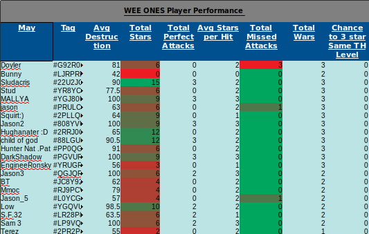

# Player Stats Logger
Retrieves info of current clan war from the Clash of Clans API and logs player performance into an excel sheet. New players are added and current ones are updated. 
## Purpose 
A clash team was logging player performance each war manually in order to rank top players every month. 
I was able to help them automate the process using the Clash of Clans API. It provides the information they were logging in manually. 
Also using excel tools such as conditions and color scaling makes it easy to find higher ratings in attributes you seek, like the image posted.  
 

## Features to Add
A few more changes I am working on is finishing up the 'Change to 3 star Same TH' and replacing the use of a local excel sheet with a Google Sheet. By doing so everyone is able to view a link to the most up-to-date document, instead of sharing the local excel sheet each time.

# Thoughts
This has been a great introduction to the use of API's, I really enjoyed working on this as a way to improve my knowledge in Python and it's capabilities. 
